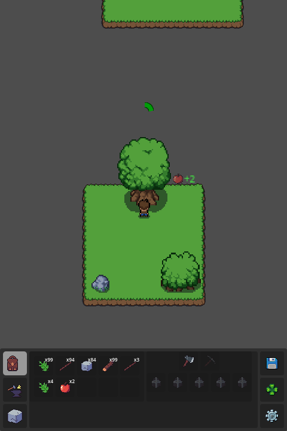
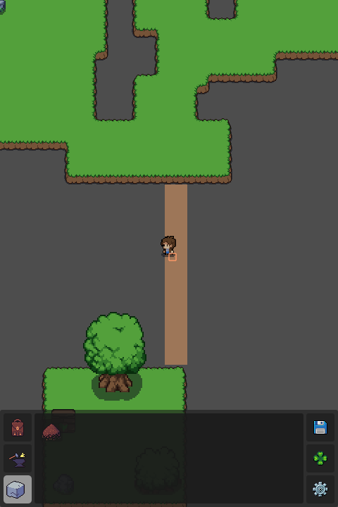
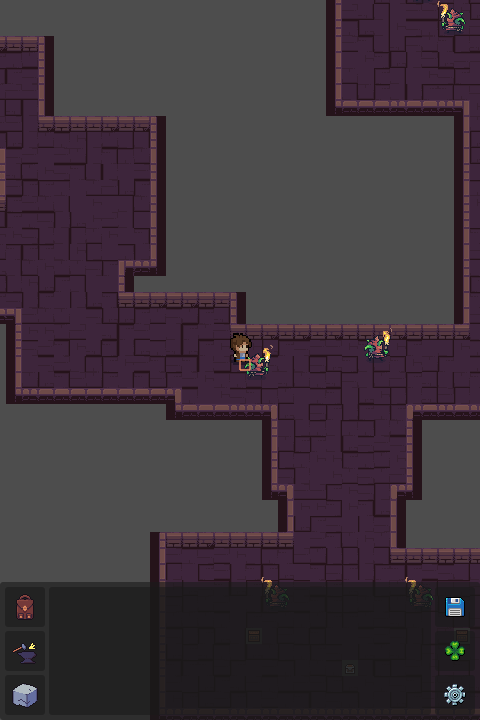

## Table of Contents
1. [About the Project](#about-the-project)
2. [Features](#features)
3. [Getting Started](#getting-started)
4. [Screenshots](#screenshots)
5. [Controls](#controls)
6. [Roadmap](#roadmap)
7. [License](#license)

## About the Project
This game combines Skyblock concepts, passive resource accumulation through Idling, and elements of incremental growth and automation, with a touch of collecting. The goal is to create a unique blend that doesn’t exist in one game yet.

Developing this project allowed me to practice programming and project management skills while building something I’ll enjoy.

## Features
- Expand your island by gathering materials.
- Explore other islands to upgrade your character and conquer the skies.
- Automate processes for resource gathering.
- Collection System
- Inventory System
- Crafting System
- Building System for adding tiles to the world during gameplay
- Automation for gathering materials
- Equipment System
- Dungeons and Auto Combat

## Getting Started
- Gather from environmental objects like the boulder and the bush.
- Craft an axe to gather from the tree.
- Expand the island to explore for a dungeon located above.
- Create automation objects to automatically collect resources.

## Screenshots

## Controls
- **Movement**: Use `WASD`, click to move, or click on highlighted objects.
- **Interact with chests**: Click on chests to open them.
- **Inventory**: Use lower interface to access menus and inventory.

## Roadmap
- Add more content such as dungeons and resources.
- Update art.
- Optimize code.
- Polish game and add optional content.

## License
This project is for personal portfolio demonstration only. No copying, modification, or redistribution is allowed without permission.
